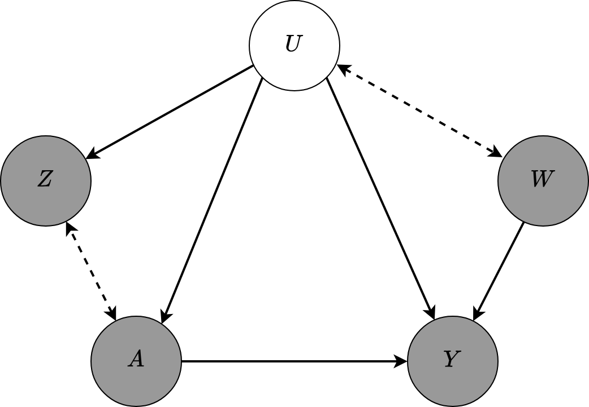

# Density-Ratio-Based-Proxy-Causal-Learning-without-Density-Ratios

This GitHub repository includes the implementation code of the paper "Density Ratio-based Proxy Causal Learning Without Density Ratios" (Accepted to AISTATS 2025). All the codes are written in Python 3 and we utilized JaX library to accelarate the implementation with GPU. Nevertheless, all the experiments can be run with CPU version of JaX library. In this paper, we address the setting of Proxy Causal Learning (PCL) with a treatment bridge function to estimate the causal effect functions dose response and conditional dose response curves.

 ## Proxy Causal Inference Directed Acyclic Graph

 The following figure illustrates an instance of a Directed Acyclic Graph (DAG) for the PCL setting. In this graph, the gray circles denote the observed variables: $A$ denotes the treatment, $Y$ denotes the outcome, $Z$ denotes the treatment proxy, and $W$ denotes the outcome proxy. The white circle denotes the unobserved confounding variable $U$. Bi-directional dotted arrows indicate that either direction in the DAG is possible, or that both variables may share a common ancestor.

 

 ## Simulations In the Paper

All the simulation codes for the paper manuscript are included inside the folder "Simulations". The subfolders are named accordingly, e.g., "Simularions/ATE_Simulations/dSpriteExperiment" folder contains the experiments for the dSprite experiments in the paper (Figure (2-b)). The jupyter notebooks inside the folder "Simulations/AnalyzeSimulationResults" illustrate the plots presented in the paper. For example, the jupyter notebook "Simulations/AnalyzeSimulationResults/Plot_ATE_dSprite_Simulation_ComplexityRegularized.ipynb" includes the plot in Figure (2-b). In order to run this notebook, you need to first run the python simulation scripts inside the folder "Simularions/ATE_Simulations/dSpriteExperiment" that will create the pickle files which stores the numerical experiment results. Below, we share the process to reproduce Figure (2-a). The others follow similarly.

* Run all the python scripts in the folder "Simulations/ATE_Simulations/SyntheticLowDim" with the following commands:
     ``` python AlternativeProxyKernel_SyntheticDataExperiment1.py```
      ``` python KernelNegativeControl_SyntheticDataExperiment1.py```
      ``` python KPV_SyntheticDataExperiment1_V2.py```
      ``` python PKIPW_SyntheticDataExperiment1.py```
      ``` python PMMR_SyntheticDataExperiment1_V2.py```

* After the simulations are done, these scripts will generate the following pickle files that contains the results:
  * "Simulations/Results/Kernel_Alternative_Proxy_Synthetic_Experiment1.pkl"
  * "Simulations/Results/Kernel_Negative_Control_Synthetic_Experiment1.pkl"
  * "Simulations/Results/KPV_Synthetic_Experiment1_V2.pkl"
  * "Simulations/Results/PKIPW_Synthetic_Experiment1.pkl"
  * "Simulations/Results/PMMR_Synthetic_Experiment1_V2.pkl"
 
* The jupyter notebook "Simulations/AnalyzeSimulationResultsFinal/Plot_ATE_SyntheticLowDim_Simulation_ComplexityRegularized.ipynb" reads the above pickle files and visualize the results.

# Python Version and Dependencies

* Python Version : Python 3.8.18

* pip version : 24.0

* Required Python Packages : Specified in requirements.txt file.

# Folder Contents

## src
This file is the source code for each causal learning algorithm and the utility scripts we used in the paper. The following is the full list.

Python Script         |  Explanation
:--------------------:|:-------------------------:
causal_models/proxy_causal_learning.py            | It includes the implementation of the following proxy causal learning algorithms: Kernel Alternative Proxy ATE and ATT algorithms (ours), Kernel Negative Control ATE and ATT algorithms [1],
causal_learning.py            | It includes the implementation of Kernel-ATE and Kernel-ATT algorithms from the paper [4]
utils/kernel_utils.py  | Kernel Classes, e.g., Gaussian Kernel and Linear Kernel
utils/linalg_utils.py | Linear Algebra utility functions, e.g., computing pairwise distances, etc.
utils/ml_utils.py | It includes data normalization function
utils/visualization_utils.py | Visualization utility functions
other_methods | This folder must include the implementations of KPV [2], PMMR [2], and PKIPW [3] algorithms. The implementation of KPV and PMMR can be taken from [5], and the implementation of PKIPW can be taken from [6].
generate_experiment_data.py | It includes the data generating functions used in the numerical experiments.

## Simulations
Each simulation presented in the paper can be reproduced using the codes in the following folders.

Simulation Folder                     |  Explanation
:------------------------------------:|:-------------------------:
ATE_Simulations/SyntheticLowDim | Synthetic Low-Dimensional Setting. Figure (2-a) can be reproduced by running the simulations in this folder.
ATE_Simulations/dSpriteExperiment | dSpriteExperiment dataset. Figure (2-b) can be reproduced by running the simulations in this folder.
ATE_Simulations/LegalizedAbortionAndCrime | Legalized Abortion and Crime dataset. Figure (2-c) can be reproduced by running the simulations in this folder.
ATE_Simulations/DeanerExperiment | Grade retention dataset. Figure (2-d) can be reproduced by running the simulations in this folder.
ATT_Simulations  | Synthetic data experiment for conditional dose response. Figure 3 can be reproduced by running the simulations in this folder.
AnalyzeSimulationResults | It contains the jupyter notebooks to reproduce the plots after running the simulations.

## Notebook_Examples
This file includes the jupyter notebook experiments of the algorithms Kernel Alternative Proxy (Ours), Kernel Negative Control [1], Kernel Proxy Control (KPV) [2], Proxy Maximum Moment Restriction (PMMR) [2], and Proximal Kernel Inverse Probability Weighted (PKIPW) [3]. The subfolder names are given accordingly, and notebooks are presented to experiment and visualize causal learning settings with different algorithms and different datasets. These notebooks can also be used for debugging and tutorials.

# References
[1] Singh, R. (2023). Kernel methods for unobserved confounding: Negative controls, proxies, and instruments.

[2] Mastouri, A., Zhu, Y., Gultchin, L., Korba, A., Silva, R., Kusner, M. J., Gretton, A., and Muandet, K. (2021). Proximal causal learning with kernels: Two-stage estimation and moment restriction. In International Conference on Machine Learning.

[3] Wu, Y., Fu, Y., Wang, S., and Sun, X. (2024). Doubly robust proximal causal learning for continuous treatments. In International Conference on Learning Representations.

[4] Singh, R., Xu, L., and Gretton, A. (2023). Kernel methods for causal functions: dose, heterogeneous and incremental response curves. Biometrika, 111(2):497–516

[5] https://github.com/liyuan9988/DeepFeatureProxyVariable

[6] https://github.com/yezichu/PCL_Continuous_Treatment